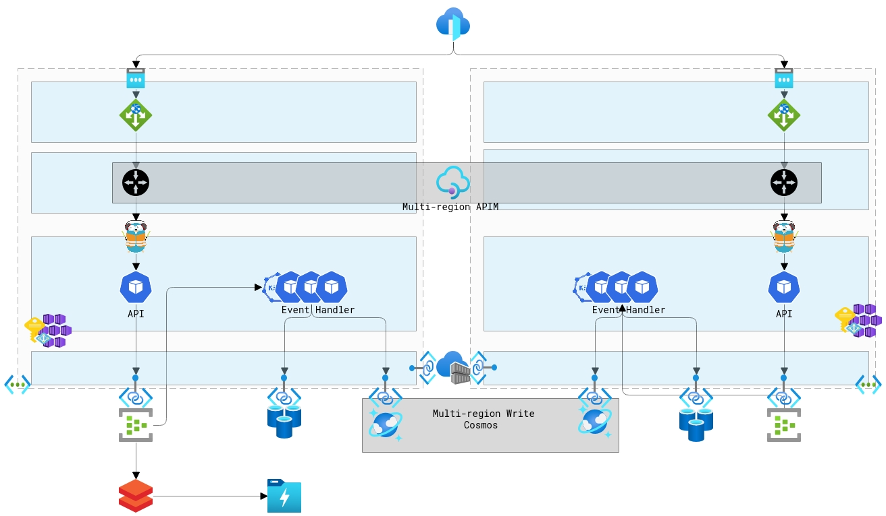

# Introduction
A very simple setup for Command Query Responsibility Separation (CQRS) in Azure that can be deployed to one or more Azure regions.
In other words, the world's most expensive random number generator....

# Deployment 

# Setup

## Prerequisite
* Azure PowerShell, Azure Cli, Terraform, Helm and Kubectl
* A public domain that you can create DNS records
   * Will use bjd.demo for this documentation 
   * The Public domain is used by Let's Encrypt to valiate domain ownership before granting tls certificates 
      * [Configure DNS Zone with Let's Encrypt's acme.sh](https://github.com/acmesh-official/acme.sh/wiki/How-to-use-Azure-DNS)

### Public DNS Records: 
_Only required if deploying application externally with APIM/AppGateway/FrontDoor_
* api.bjd.demo - CNAME to the Azure Front Door Name 
* api.us.bjd.demo - Public IP Address of Azure Gateway US Region.This needs to be be created after the App Gateway is configured. The ARM template will ouput the public IP address
* api.uk.bjd.demo - Public IP Address of Azure Gateway UK Region.This needs to be be created after the App Gateway is configured. The ARM template will ouput the public IP address

### Let's Encrypt TLS Certificates using acme.sh Script
* Installation
    * curl https://get.acme.sh | sh
* Required Certificates 
    * acme.sh --issue --dns dns_azure -d api.ingress.bjd.demo
    * acme.sh --toPkcs -d api.ingress.bjd.demo --password $PASSWORD
* Optional Certificates 
    * _Only required if deploying application externally with APIM/AppGateway/FrontDoor_
    * APIM Certificate: 
        * acme.sh --issue --dns dns_azure -d portal.bjd.demo -d management.bjd.demo -d developer.bjd.demo -d api.apim.us.bjd.demo -d api.apim.uk.bjd.demo -d management.scm.bjd.demo
        * acme.sh --toPkcs -d portal.bjd.demo --password $PASSWORD
    * AppGateway Certificate: 
        * acme.sh --issue --dns dns_azure -d api.bjd.demo -d api.us.bjd.demo -d api.uk.bjd.demo
        * acme.sh --toPkcs -d api.bjd.demo --password $PASSWORD
    
## Infrastructure Steps
* cd ./Infrastructure
* ./create_infrastructure.sh -r eastus2 -r ukwest --domain bjd.demo
    * Generates a Terraform variable file with randomize variables then applies configuration 
* ./setup_diagnostics.sh -n ${appName} -r eastus2 -r ukwest _optional_
    * appName will be display at the end of the create_infrastructure.sh script 

## Application Deployment 
* cd ./Infrastructure
* ./deploy_application.sh -n ${appName} -r eastus2 -r ukwest --domain bjd.demo --hostname api.ingress --cert {path_to_ingress_cer_file} --key {path_to_ingress_key_file}

# Expose API Externally 
* The create_infrastructure.sh and deploy_application.sh scripts only create the foundations for this demo application. 
* The demo can be expanded to include additional Azure resources - Front Door, API Maanagment, Azure App Gateway - for external access.

## Automated Steps
* pwsh
* cd ./Infrastructure
* .\create_external_infrastructure.ps1 -AppName ${appName} -Regions @("eastus2","ukwest") -SubscriptionId xxxxxxxx-
    xxxx-xxxx-xxxx-xxxxxxxxxxxx -DeploymentType multi -ApiManagementPfxFilePath ~/certs/apim.pfx -AppGatewayPfxFilePath ~/certs/gw.pfx -PFXPassword xyz -AksIngressUrl api.ingress.bjd.demo -ApiManagementUrls @("api.apim.us.bjd.demo","api.apim.uk.bjd.demo") -AppGatewayUrls @("api.us.bjd.demo","api.uk.bjd.demo") -FrontDoorUrl api.bjd.demo

## Manual Steps:
* You must take the output of the App Gateway ARM template then update your external DNS Names as with those IP Address.
* You need to then log into the Azure Portal > App Gateway (per region) and associate each App Gateway with their regional WAF policy
* You need to manually enable TLS on the custom Front Door Uri. You can use the Front Door provided certificate 

# Testing
## Test Local Deployment directly on AKS clusters 
* ./Scripts/create_keys.sh 100 
* ./Scripts/get_keys.sh ${keyId} 
    * Where ${keyId} is a GUID taken from the output of create_keys.sh

## Test Application Gateways Individually using PowerShell
* Obtain your APIM subscription key
* $h = New-APIMHeader -key $apiSubscriptionKey _New-APIMHeader is a method in bjd.Azure.Functions_
* Invoke-RestMethod -UseBasicParsing -Uri https://api.us.bjd.demo/k/10?api-version=2020-05-04 -Method Post -Headers $h
* Invoke-RestMethod -UseBasicParsing -Uri https://api.uk.bjd.demo/k/10?api-version=2020-05-04 -Method Post -Headers $h
* $keyId = copy a reply from the commands above
* Invoke-RestMethod -UseBasicParsing -Uri https://api.us.bjd.demo/k/${keyId}?api-version=2020-05-04 -Headers $h
* Invoke-RestMethod -UseBasicParsing -Uri https://api.uk.bjd.demo/k/${keyId}?api-version=2020-05-04 -Headers $h

## Test Azure Front Door globally with Azure ACI
* cd .\Infrastructure\ACI
* New-AzResourceGroup -Name ${appName}_tests_rg -l eastus2
* New-AzResourceGroupDeployment -Name aci -ResourceGroupName ${appName}_testing_rg -Verbose -TemplateFile .\azuredeploy.json -apimSubscriptionKey ${apiSubscriptionKey} -frontDoorUrl https://api.bjd.demo -keyGuid ${keyId}
* az container logs --resource-group ${appName}_tests_rg --name utils-australiaeast-get
* az container logs --resource-group ${appName}_tests_rg --name utils-australiaeast-post
* az container logs --resource-group ${appName}_tests_rg --name utils-westeurope-get
* az container logs --resource-group ${appName}_tests_rg --name utils-westeurope-post
* az container logs --resource-group ${appName}_tests_rg --name utils-japaneast-get

## Test using Azure Static Web Apps using Playwright
* TBD

# To Do List 
- [x] Infrastructure 
- [x] Test Flexvol with local.settings.json for Functions in container
- [x] Sample Python Script to create events published to Event Hub
- [x] Azure Function to process event, storing in Cosmos and Redis Cache
- [x] Go Write API to generate events to Event Hub 
- [x] Go Read API to read from Redis 
- [x] Go Read API to read from Cosmos db using SQL API
- [x] Deployment artifacts to Kubernetes
- [x] Configure Scaling with Keda 
- [x] Add Application Insights - golang
- [x] Add Application Insights - Azure Funtions
- [x] Log Analytics automation 
- [x] Update deployments to Helm 3
- [x] Multiple Region Deployment with Azure Front Door
- [x] Add support for Cosmos DB private endpoint
- [x] Add support for Storage private endpoint
- [x] Add support for Redis Cache private endpoint
- [x] Add support for Azure Container Repo private endpoint
- [x] Add support for Azure Event Hubs private endpoints
- [x] Add support for Azure Private DNS Zones
- [x] Update diagrams 
- [x] Update documention
- [x] Update for Terraforms to create main infrastructure components
- [x] GitHub Actions pipeline 
- [x] Simplify deployment
- [ ] Playwright automated UI testing
