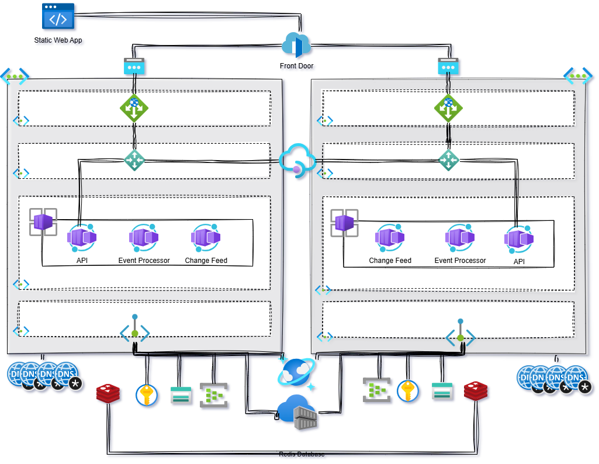

# Introduction
A very simple Multi-Region design for an application following Command Query Responsibility Separation (CQRS) principles in Azure.
In other words, the world's most expensive random number generator....

# Prerequisites
* A Posix compliant System. It could be one of the following:
    * [Github CodeSpaces](https://github.com/features/codespaces)
    * Azure Linux VM - Standard_B1s VM will work ($18/month)
    * Windows 11 with [Windows Subsystem for Linux](https://docs.microsoft.com/en-us/windows/wsl/install)
* [dotnet 8](https://dotnet.microsoft.com/download) - The .NET SDK
* [Visual Studio Code](https://code.visualstudio.com/) or equivalent - A lightweight code editor
* [Docker](https://www.docker.com/products/docker-desktop) - The Docker Desktop to build/push containers
* [Azure CLI](https://docs.microsoft.com/en-us/cli/azure/install-azure-cli) - A tool for managing Azure resources
* [PowerShell](https://docs.microsoft.com/en-us/powershell/scripting/install/installing-powershell) - The PowerShell Core for running scripts
* [git](https://git-scm.com/) - The source control tool
* [Taskfile](https://taskfile.dev/#/) - A task runner for the shell
* [Terraform](https://www.terraform.io/) - A tool for building Azure infrastructure and infrastructure as code
* If exposing application externally then a public domain that you can create DNS records

* [Required Certificates](./docs/letsencrypt.md)

> * **Note:** The documentation will use bjd.demo throughout as the root domain.  This can be replaced with your own domain
> * **Note:** The Github Codespaces environment has all the tools pre-installed and configured.  You can use the following link to open the project in Github Codespaces: [Open in Github Codespaces](https://codespaces.new/briandenicola/azure-multi-region-proof-of-concept?quickstart=1)

## Public DNS Records: 
* The following DNS records are required for the application to work correctly.  These are used for the application to be accessed externally.  The following records are required: 
Name | Usage | DNS Record Type | IP Address
------ | ---- | ---- | ----
api.bjd.demo | Azure Front Door  |  CNAME | <Front Door URL>
api.westus.bjd.demo | App Gateway | A | <App Gateway IP Address in West US>
api.eastus.bjd.demo | App Gateway | A | <App Gateway IP Address in East US>

## Task
* The deployment of this application has been automated using [Taskfile](https://taskfile.dev/#/).  This was done instead of using a CI/CD pipeline to make it easier to understand the deployment process.  
* Of course, the application can be deployed manually
* The Taskfile is a simple way to run commands and scripts in a consistent manner.  
* The [Taskfile](../Taskfile.yaml) definition is located in the root of the repository
* The Task file declares the default values that can be updated to suit specific requirements: 
Name | Usage | Default Value
------ | ------ | ------
TITLE | Value used in Azure Tags | CQRS Multi-region Pattern in Azure
DEFAULT_REGIONS | Default region to deploy to | westus3
DOMAIN_ROOT | Default root domain used for all URLs & certs | bjd.demo

* Running the `task` command without any options will run the default command. This will list all the available tasks.
    * `task up`                 : Builds complete environment
    * `task down`               : Destroys all Azure resources and cleans up Terraform
    * `task build`              : Builds containers and pushes to Azure Container Registry
    * `task deploy`             : Deploys application via Helm
    * `task dns`                : Gets the IP Address of the Application Gateways
    * `task init`               : Initialized Terraform modules
    * `task apply`              : Creates Azure infrastructure and deploys application code

# Setup

## Infrastructure
## Application Build  
## Application Deployment 
## Manual Steps

# External Access
## Infrastructure
## UI Deployment 
## Manual Steps

# Testing

# Backlog
- [x] Moved to Taskfile for deployments instead of script
- [] Code and infrastructure updates to Managed Identities
- [] General rev updates of TF resources
- [] Update naming standards
- [] Moved to Managed Redis instead of Azure Cache for Redis
- [] Adopt new APIM v2 features and platform
- [] Review AppGateway and Front Door configurations
- [] Code Updates for code and all modules to C# 9.0, Go 1.24, and Node 14
- [] Gracefully handle issues on startup
- [] Update documentation 
